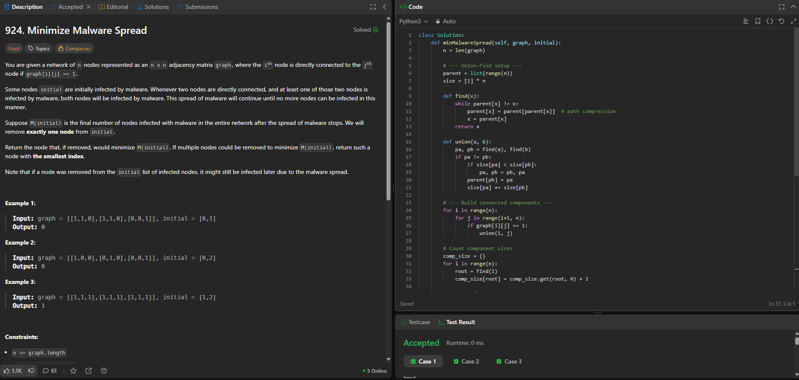
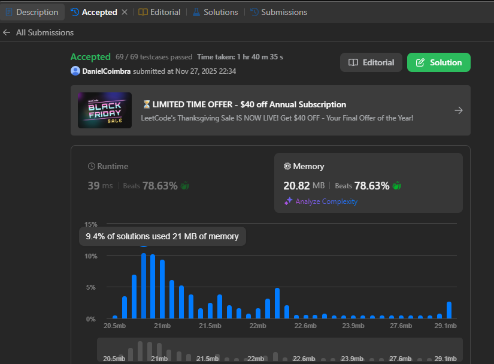

# Trabalho_Grafos_Grupo42

### Trabalho 04 - 27/11/2025

## Aluno 
| Matrícula | Nome |  
|-----------------------|---------------------|  
| 18/0113097 | Daniel Coimbra dos Santos |  

## Descrição do projeto
Resolução de questões do LeetCode para demonstrar na prática os conhecimentos adquiridos acerca do conteúdo Algoritmos de Grafos

### Questão de Dificuldade Difícil:
#### 969. Pancake Sorting
Given an array of integers arr, sort the array by performing a series of pancake flips.

In one pancake flip we do the following steps:

Choose an integer k where 1 <= k <= arr.length.
Reverse the sub-array arr[0...k-1] (0-indexed).
For example, if arr = [3,2,1,4] and we performed a pancake flip choosing k = 3, we reverse the sub-array [3,2,1], so arr = [1,2,3,4] after the pancake flip at k = 3.

Return an array of the k-values corresponding to a sequence of pancake flips that sort arr. Any valid answer that sorts the array within 10 * arr.length flips will be judged as correct.

Constraints:

1 <= arr.length <= 100
1 <= arr[i] <= arr.length
All integers in arr are unique (i.e. arr is a permutation of the integers from 1 to arr.length).

## Capturas de tela

Pancake Sorting - Questão e Código
 
 

Runtime Metrics
 

Runtime Metrics
 

## Conclusões

O algoritmo funciona em 4 etapas principais:

1. Encontrar componentes conectadas (Union–Find)
Agrupamos nós que podem transmitir infecção dentro do mesmo bloco.

2. Calcular o tamanho de cada componente
Determina quantos nós serão infectados caso o componente seja comprometido.

3. Contar quantos infectados existem em cada componente
Só componentes com exatamente 1 infectado inicial podem ser salvas removendo esse infectado.

4. Escolher o infectado ideal
Remove-se o infectado que:
é o único de sua componente, e cuja componente tem maior tamanho. (No caso de empate, escolhe o menor índice)

| Etapa                                   | Tempo                                    | Espaço   |
| --------------------------------------- | ---------------------------------------- | -------- |
| Construção dos componentes (Union–Find) | O(n²)                                    | O(n)     |
| Contagem de tamanhos e infectados       | O(n)                                     | O(n)     |
| Escolha do melhor infectado             | O(k) (k = número de infectados iniciais) | O(1)     |
| **Total**                               | **O(n²)**                                | **O(n)** |

**Pontos Fortes**: Evita múltiplas simulações de infecção, aproveita a estrutura natural do grafo (componentes), rápido e eficiente para n <= 300.
**Ponto Fracos**: Não diferencia subestruturas dentro de um componente, exige perceber que a infecção é "tudo ou nada" por componente.

## Sobre o algoritmo
O comportamento da infecção torna o grafo dividível em componentes conectadas: se um nó é infectado, toda a componente será contaminada.
O Union–Find detecta essas componentes rapidamente.
Depois, basta identificar qual infectado é o único dentro de sua componente e que, portanto, pode impedir a infecção de todo o bloco ao ser removido.

Essa técnica é comum em problemas onde a propagação depende só da conectividade e não da ordem dos eventos.

---

## Grupo
 
      <b><a href="https://github.com/DanielCoimbra">Daniel Coimbra</a></b> 
